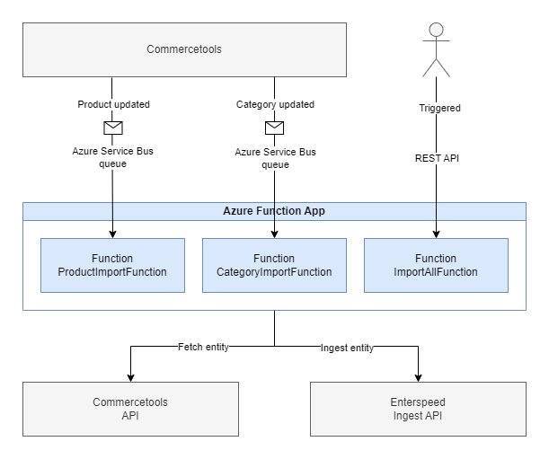

# Enterspeed Commercetools Source

A ready to use integration service for connecting Commercetools as an
Enterspeed data-source by importing products, variants and categories.

Included in the respository is a reference implementation based on Azure
Functions, that may be deployed directly - or integrated into your own
projects.

The included default implementation includes products, variants, availability,
pricing and attributes, along with categories and their custom fields.

## Installation

To get started with the Enterspeed Commercetools integration you should
follow these steps:

### Install the NuGet package

With .NET CLI

```bash
dotnet add package Enterspeed.Source.Commercetools --version <version>
```

Using the Package Manager

```bash
Install-Package Enterspeed.Source.Commercetools -Version <version>
```

### Creating a Commercetools API client

Create a new Commercetools API client following [this documentation](https://docs.commercetools.com/merchant-center/api-clients).

The required scopes for the integration are as follows.

```text
view_products:{projectKey}
view_published_products:{projectKey}
view_categories:{projectKey}
```

### Setting up the integration service

Attach the Enterspeed Commercetools Integration and the Commercetools SDK
to dependecy injection in your applications startup, we've provided an
extension to `IServiceCollection` for ease of configuration.

```csharp
services.UseCommercetoolsApi(Configuration);
services.AddEnterspeedCommercetoolsIntegration(config =>
  {
    config.SetEnterspeedConfiguration(new EnterspeedConfiguration
    {
        ApiKey = "Your Enterspeed API key",
        BaseUrl = "Your Enterspeed base url"
    });

    config.SetCommercetoolsProjectKey("Your Commercetools project key");
  });
```

Add the following to your runtimes app settings to configure the Commercetools SDK.

```json
{
  "CommercetoolsApi": {
    "ProjectKey": "Your Commercetools project key",
    "ClientId": "Your Commercetools API Client id",
    "ClientSecret": "Your Commercetools API Client secret",
    "AuthorizationBaseAddress": "Your Commercetools authorization base url",
    "ApiBaseAddress": "Your Commercetools API base url"
  }
}
```

For more information on the Commercetools SDK, see their documentation on their
[GitHub project](https://github.com/commercetools/commercetools-dotnet-core-sdk-v2).

## Using the integration service

Use `IEnterspeedImportService` to ingest resources from Commercetools into
Enterspeed, one entity product or category at a time.

```csharp
public interface IEnterspeedImportService
{
    Task ImportProduct(string productId, long version);
    Task ImportCategory(string categoryId, long version);
}
```

Use `IEnterspeedImportAllProducts` to ingest all products into Enterspeed,
in a continuous batch - the default implementation processes the ingestion
in-process, but may be extended utilize a messaging queue.

```csharp
public interface IEnterspeedImportAllProducts
{
    Task<ImportAllResultModel> ImportAllProducts();
}
```

Use `IEnterspeedImportAllCategories` to ingest all categories into Enterspeed,
in a continuous batch - the default implementation processes the ingestion
in-process, but may be extended utilize a messaging queue.

```csharp
public interface IEnterspeedImportAllCategories
{
    Task<ImportAllResultModel> ImportAllCategories();
}
```

## Extending the integration service

The integration makes use of dependency injection, to ensure the components are
extendable and to ensure a loosely coupled solution.

The integration ships ready to use with sensible defaults, supporting the
ingestion of products, variants and categories.  
The defaults will not apply to everyone, so services, repositories, providers
and mappers are replacable using dependency injection.

The easiest way to extend the functionality of a mapper without replacing it is
to decorate it, otherwise see the [EnterspeedCommercetoolsConfiguration](src/Enterspeed.Commercetools.Integration/Configuration/EnterspeedCommercetoolsConfiguration.cs)
class for full overview of default implementations and possible replacement.

Overriding can be done during startup, overrides should implement the library
provided interfaces in the [`Api`](src/Enterspeed.Commercetools.Integration/Api) namespace.

```csharp
services.AddEnterspeedCommercetoolsIntegration(config =>
  {
    // ...

    // Override mappers, as needed
    config
        .SetDateTimeMapper<MyDateTimeMapper>()
        .SetPriceMapper<MyPriceMapper>()
        .SetAvailabilityMapper<MyAvailabilityMapper>()
        .SetProductMapper<MyProductMapper>()
        .SetCategoryMapper<MyCategoryMapper>()
        .SetVariantMapper<MyVariantMapper>()
        .SetPropertyMapper<MyPropertyMapper>()
        .SetAssetMapper<MyAssetMapper>()
        .SetCustomFieldsMapper<MyCustomFieldsMapper>()
        .SetMoneyMapper<MyMoneyMapper>();

    // Override services, as needed
    config
        .SetTypeProvider<MyTypeProvider>()
        .SetPropertyKeyFactory<MyPropertyKeyFactory>()
        .SetUrlBuilder<MyUrlBuilder>();
  });
```

### Enterspeed Integration and defaults

The `Enterspeed.Commercetools.Integration` library contains the services,
providers, repositories and mappers needed to integrate a Commercetools project
into Enterspeed as a data-source. Everything in the library is extendable to
the point where underlying services may be completely replaced.

The library itself is not runnable by itself, but may be integrated into a
new or already existing cloud-native (or on-prem if required) integration
setup.

The library makes use of mappers to map Commercetools entity data into
`EnterspeedProperties`. The mappers must implement the `IMapper` interface,
included in the library itself.

```csharp
public interface IMapper<in TSource, TDest>
{
    Task<TDest> Map(TSource source);
}
```

If your solution requires some of the already implemented mappers and services
to be overriden, refer to the [EnterspeedCommercetoolsConfiguration](src/Enterspeed.Commercetools.Integration/Configuration/EnterspeedCommercetoolsConfiguration.cs)
class in the repository.

The default `IEnterspeedEntityTypeProvider` implementation resolves Enterspeed
entity types based on the Commercetools entity, it defaults to `category` for
categories, `variant` for variants and the Commercetools product type key for
products.

The default `IEnterspeedUrlBuilder` implementation builds URLs to categories
using their ancestor hierarchy, and product URLs using their first categories
ancestor hierarchy.

The default `IEnterspeedPropertyKeyFactory` implementation creates the property
keys used in mapping, replaces dashes with underscores when mapping to
Enterspeed e.g. `-` to `_`.

### Asynchronous design

Since the integration is potentially importing a lot of entities from
Commercetools, which will require multiple requests, the integration makes use
of asynchronous design to send the requests concurrently and unblock the CPU
while waiting for responses.

The default bulk import services will try to import all entities, even if fail
the import.

## Reference implementation - Azure Functions

The repository includes a [reference implementation](samples/Enterspeed.Commercetools.Integration.AzureFunctions)
for a ready-to-use integration using Azure Functions.



The project constists of three different Azure functions

- `CategoryImportFunction` imports a category from Commercetools to Enterspeed,
  invoked using a Service Bus trigger on a queue named `commercetools-category-import`.

- `ProductImportFunction` imports a product its variants from Commercetools to
  Enterspeed, invoked using a Service Bus trigger on a queue named `commercetools-product-import`.

- `ImportAllFunction` imports every category, product and its variants from
  Commercetools to Enterspeed, invoked using a HTTP trigger, for a manual full
  import.

The Service Bus triggers are listening on specific Azure Service Bus queues,
which will receive a message when a category or product entity is changed in
Commercetools.

### Setting up the reference implemenation

An Azure Service Bus is required to run the reference implementation.  
It should contains at least two queues named
`commercetools-category-import` and `commercetools-product-import`.

To setup Commercetools to send a message directly to the service bus on entity
updates, read the [Subscription documentation](https://docs.commercetools.com/api/projects/subscriptions)
in the Commercetools API docs.

To run the reference locally, configure the project using a
`local.settings.json` configuration file, defaults are available in the example
file [`local.settings.json.example`.](samples/Enterspeed.Commercetools.Integration.AzureFunctions/local.settings.json.example).  
See the [Installation](#installation) part of the README to configure the
runtime, along with an Azure Service Bus connection string.

To run the reference in Azure, build the function as part of your CI/CD,
or locally - and deploy it to an Azure Function.  
Follow the Azure documentation on how to configure the function in the cloud.

## Using the integration in other public clouds, or on-prem

The reference implementation makes use of the
`Enterspeed.Commercetools.Integration` library and its default implementations
for the integration.  
As everything is contained in the library itself, it is a small task to adapt
it to another public clouds offerings, such as AWS, GCP or even on-prem
integration setups.

See the [ProductImportFunction](samples/Enterspeed.Commercetools.Integration.AzureFunctions/Functions/ProductImportFunction.cs) and [CategoryImportFunction](samples/Enterspeed.Commercetools.Integration.AzureFunctions/Functions/CategoryImportFunction.cs)
for inspiration:

```csharp
public class CategoryImportFunction
{
    private readonly IEnterspeedImportService _enterspeedImportService;

    public CategoryImportFunction(IEnterspeedImportService enterspeedImportService)
    {
        _enterspeedImportService = enterspeedImportService;
    }

    [Function(nameof(CategoryImportFunction))]
    public async Task Run(
        [ServiceBusTrigger(
            "commercetools-category-import",
            Connection = "ServiceBusConnectionString")]
        CommercetoolsMessage message)
    {
        await _enterspeedImportService.ImportCategoryAsync(message.Resource.Id, message.ResourceVersion);
    }
}
```

## Changelog

See new features, fixes and breaking changes in the [changelog](./CHANGELOG.md).


## Contributing

Pull requests are very welcome.  
Please fork this repository and make a PR when you are ready.  

Otherwise you are welcome to open an Issue in our [issue tracker](https://github.com/enterspeedhq/enterspeed-source-commercetools/issues).


## License

Enterspeed Commercetools Source is [MIT licensed](./LICENSE)
